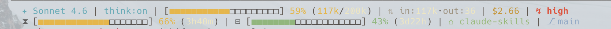

# claude-skills

A collection of custom skills for [Claude Code](https://claude.ai/code).

## Skills

### [webup-statusline](./webup-statusline/)

Generate and install a custom Claude Code status line with selectable columns and color themes.



**🌟 4 种主题随你选**

| Theme | 风格 |
|-------|------|
| `dracula` | **Dracula 暗黑紫** — 高饱和荧光色，赛博感拉满 |
| `gruvbox` | **Gruvbox 复古暖** — 柔和暖色调，经典耐看 |
| `robbyrussell` | **Robbyrussell 经典 zsh** — 无图标纯净风，oh-my-zsh 老用户必选 |
| `minimal` | **Minimal 极简** — 纯文本 + 圆点分隔，极简主义 |

**功能列表**

- 模型名称、思考模式（`think:on`）
- 上下文进度条 + 使用率 + 实际 token 数（如 `59% (117k/200k)`）
- 输入 / 输出 token 分类显示
- 会话消费、推理强度、输出风格
- 五小时 & 七天 API 限额进度条 + 重置倒计时
- Git 分支（脏状态检测）、目录、worktree
- 双行布局支持（`--line2`）

**Install**

```bash
# 复制 skill 到 Claude Code skills 目录
cp -r webup-statusline ~/.claude/skills/

# 交互式安装（推荐）
/webup-statusline
```

或直接指定参数：

```bash
npx -y bun ~/.claude/skills/webup-statusline/scripts/generate.mjs \
  --elements model,thinking,context,io,cost,effort,five_hour,week,git,dir \
  --line2 five_hour,week,git,dir \
  --theme gruvbox \
  --install
```

安装后重启 Claude Code 生效。

**Requirements**

- [Claude Code](https://claude.ai/code)
- `jq` — 解析 JSON 输入
- `bun` 或 `npx` — 运行生成器脚本
